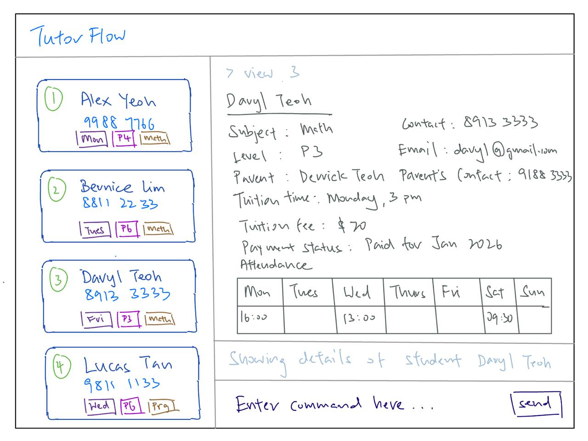

# TutorFlow

TutorFlow is a desktop application for full-time freelance private tutors who teach primary school mathematics and programming. It centralizes client communication, lets you log weekly sessions, and shows the next upcoming appointment for each student directly in the contact book. This prevents double-booking and lost income without requiring a full calendar workflow.

Most interactions happen using a CLI (Command Line Interface), while the GUI provides a clear overview of contacts and upcoming sessions.

## Installation Instructions

### Prerequisits

Ensure that Java 17 is installed on your system.

### Installation Steps

1. Download the latest `.jar` release from [here](https://github.com/AY2526S2-CS2103T-T09-3/tp/releases).
2. Move the downloaded `.jar` file into your desired folder.
3. From that folder, open a terminal or command prompt.
4. Run the command `java -jar tutorflow.jar` to start the app.

## Features

* View your appointment details with ease!
* Leave no student behind with our attendance tracking feature!
* Ensure all tuition fees are paid on time through our payments tracker!
* Mixing up the parents' and tutees' names? Fret not, our app allows you to link both names together!
* Keep in track with your tutees' progress with our progress tracker!

## Helpful Links

* [User Guide](https://ay2526s2-cs2103t-t09-3.github.io/tp/UserGuide.html)
* [Developer Guide](https://ay2526s2-cs2103t-t09-3.github.io/tp/DeveloperGuide.html)
* [About Us](https://ay2526s2-cs2103t-t09-3.github.io/tp/AboutUs.html)

## Acknowledgements

This project is based on the AddressBook-Level3 project created by the [SE-EDU initiative](https://se-education.org).
