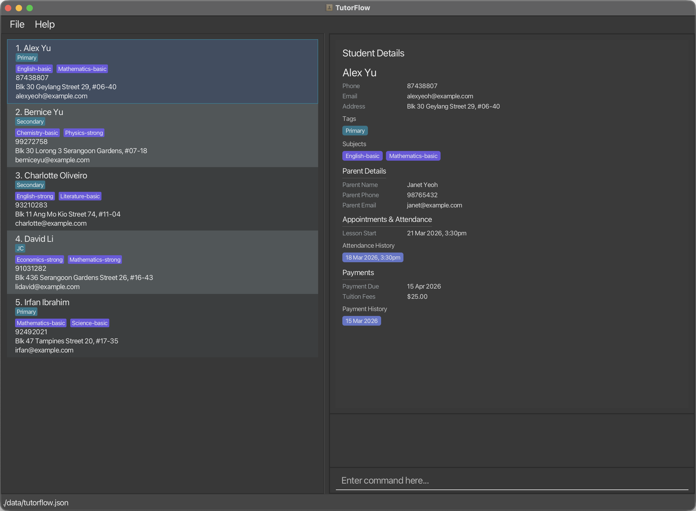

TutorFlow is a **desktop app for managing contacts, optimized for use via a Command Line Interface** (CLI) while still having the benefits of a Graphical User Interface (GUI). If you can type fast, TutorFlow can get your contact management tasks done faster than traditional GUI apps.

* Table of Contents
{:toc}

--------------------------------------------------------------------------------------------------------------------

## Quick start

1. Ensure you have Java `17` or above installed in your Computer. 
   **Mac users:** Ensure you have the precise JDK version prescribed [here](https://se-education.org/guides/tutorials/javaInstallationMac.html).

1. Download the latest `.jar` file from [here](https://github.com/AY2526S2-CS2103T-T09-3/tp/releases).

1. Copy the file to the folder you want to use as the _home folder_ for TutorFlow.

1. Open a command terminal, `cd` into the folder you put the jar file in, and use the `java -jar tutorflow.jar` command to run the application. 
   A GUI similar to the below should appear in a few seconds. Note how the app contains some sample data. 
   

1. Type the command in the command box and press Enter to execute it. e.g. typing **`help`** and pressing Enter will open the help window. 
   Some example commands you can try:

   * `list` : Lists all contacts.

   * `add student n/John Doe p/98765432 e/johnd@example.com a/John street, block 123, #01-01` : Adds a contact named `John Doe` to the address book.

   * `delete student 3` : Deletes the 3rd student shown in the current list.

   * `clear` : Deletes all contacts.

   * `exit` : Exits the app.

1. Refer to the [Features](#features) below for details of each command.

--------------------------------------------------------------------------------------------------------------------

## Features

**:information_source: Notes about the command format:** 

* Words in `UPPER_CASE` are the parameters to be supplied by the user. 
  e.g. in `add student n/NAME`, `NAME` is a parameter which can be used as `add student n/John Doe`.

* Items in square brackets are optional. 
  e.g `n/NAME [t/TAG]` can be used as `n/John Doe t/friend` or as `n/John Doe`.

* Items with `…`​ after them can be used multiple times including zero times. 
  e.g. `[t/TAG]…​` can be used as ` ` (i.e. 0 times), `t/friend`, `t/friend t/family` etc.

* Parameters can be in any order. 
  e.g. if the command specifies `n/NAME p/PHONE_NUMBER`, `p/PHONE_NUMBER n/NAME` is also acceptable.

* Extraneous parameters for commands that do not take in parameters (such as `help`, `list`, `exit` and `clear`) will be ignored. 
  e.g. if the command specifies `help 123`, it will be interpreted as `help`.

* If you are using a PDF version of this document, be careful when copying and pasting commands that span multiple lines as space characters surrounding line-breaks may be omitted when copied over to the application.

--------------------------------------------------------------------------------------------------------------------

## Student Management

Commands for managing student records — adding, editing, viewing, finding and deleting students.

### Adding a student : `add student`

Adds a student to the address book.

Format: `add student n/NAME p/PHONE_NUMBER e/EMAIL a/ADDRESS [t/TAG]…​`

:bulb: **Tip:**
A student can have any number of tags (including 0). Use `add tag` to add tags after a student is created.

Examples:
* `add student n/John Doe p/98765432 e/johnd@example.com a/John street, block 123, #01-01`
* `add student n/Betsy Crowe t/friend e/betsycrowe@example.com a/Newgate Prison p/1234567 t/criminal`

### Editing a student : `edit student`

Edits an existing student's basic details in the address book.

Format: `edit student INDEX [n/NAME] [p/PHONE] [e/EMAIL] [a/ADDRESS]`

* Edits the student at the specified `INDEX`. The index refers to the index number shown in the displayed student list. The index **must be a positive integer** 1, 2, 3, …​
* At least one of the optional fields must be provided.
* Existing values will be updated to the input values.

Examples:
* `edit student 1 p/91234567 e/johndoe@example.com` edits the phone number and email address of the 1st student.
* `edit student 2 n/Betsy Crower` edits the name of the 2nd student.

### Deleting a student : `delete student`

Deletes the specified student from the address book.

Format: `delete student INDEX`

* Deletes the student at the specified `INDEX`.
* The index refers to the index number shown in the displayed student list.
* The index **must be a positive integer** 1, 2, 3, …​

Examples:
* `list` followed by `delete student 2` deletes the 2nd student in the address book.
* `find student Betsy` followed by `delete student 1` deletes the 1st student in the results of the `find student` command.

### Viewing a student's details : `view`

Selects and displays the full details of a student.

Format: `view INDEX`

* Selects the student at the specified `INDEX`. The index refers to the index number shown in the displayed student list. The index **must be a positive integer** 1, 2, 3, …​

Examples:
* `view 1` displays the details of the 1st student.
* `view 3` displays the details of the 3rd student.

### Listing all students : `list`

Shows a list of all students in the address book.

Format: `list`

### Locating students by name : `find student`

Finds students whose names contain any of the given keywords.

Format: `find student KEYWORD [MORE_KEYWORDS]`

* The search is case-insensitive. e.g `hans` will match `Hans`
* The order of the keywords does not matter. e.g. `Hans Bo` will match `Bo Hans`
* Only the name is searched.
* Only full words will be matched e.g. `Han` will not match `Hans`
* Students matching at least one keyword will be returned (i.e. `OR` search).
  e.g. `Hans Bo` will return `Hans Gruber`, `Bo Yang`

Examples:
* `find student John` returns `john` and `John Doe`
* `find student alex david` returns `Alex Yeoh`, `David Li` 
  

--------------------------------------------------------------------------------------------------------------------

## Tag Management

Commands for managing the labels (tags) assigned to students.

### Adding tags to a student : `add tag`

Adds one or more tags to an existing student. Existing tags are kept.

Format: `add tag INDEX t/TAG [t/TAG]…​`

* Adds tag(s) to the student at the specified `INDEX`. The index refers to the index number shown in the displayed student list. The index **must be a positive integer** 1, 2, 3, …​
* At least one `t/` prefix must be provided.
* Tags that already exist on the student will not be duplicated.

Examples:
* `add tag 1 t/friends` adds the tag `friends` to student 1.
* `add tag 2 t/friends t/CS2103` adds two tags to student 2.

### Editing a student's tags : `edit tag`

Replaces all tags on a student with a new set of tags. Providing no tags clears all tags.

Format: `edit tag INDEX [t/TAG]…​`

* Edits the tags of the student at the specified `INDEX`. The index refers to the index number shown in the displayed student list. The index **must be a positive integer** 1, 2, 3, …​
* All existing tags are replaced by the provided tags.
* Providing one `t/` prefix with no value clears all tags from the student.

Examples:
* `edit tag 1 t/JC t/J1` sets the tags of student 1 to `JC` and `J1`.
* `edit tag 2 t/` clears all tags from student 2.

### Deleting tags from a student : `delete tag`

Deletes one or more tags from a student by their tag index numbers.

Format: `delete tag INDEX t/TAG_INDEX [t/TAG_INDEX]…​`

* Deletes tag(s) from the student at the specified `INDEX`. The index refers to the index number shown in the displayed student list. The index **must be a positive integer** 1, 2, 3, …​
* `TAG_INDEX` refers to the numbered position of the tag as shown in the student's tag list in the app. The index **must be a positive integer** 1, 2, 3, …​
* At least one `t/` prefix must be provided.
* All specified tag indices must be valid (i.e. within the student's tag list).

Examples:
* `delete tag 1 t/2` deletes the 2nd tag from student 1.
* `delete tag 1 t/2 t/3` deletes the 2nd and 3rd tags from student 1.

### Locating students by tag : `find tag`

Finds students whose tags match any of the given keywords.

Format: `find tag t/TAG [t/MORE_TAGS]…​`

* At least one `t/` prefix must be provided.
* Multiple `t/` prefixes are allowed.
* Tags can contain spaces (e.g. `t/Upper Sec`, `t/JC Year 1`).
* The search is case-insensitive.
* Partial matching is supported (e.g. `t/math` matches `Mathematics`).
* Students matching **at least one** tag keyword will be returned (i.e. `OR` search).
* The displayed list is updated to show only matching students.

Examples:
* `find tag t/JC` returns all students tagged with any tag containing `JC`.
* `find tag t/JC t/Sec1` returns all students with a tag matching `JC` or `Sec1`.

--------------------------------------------------------------------------------------------------------------------

## Academic Management

Commands for managing a student's academic subjects and performance notes.

### Adding subjects to a student : `add acad`

Adds one or more subjects to an existing student's academics. Existing subjects are kept.

Format: `add acad INDEX s/SUBJECT [l/LEVEL] [s/SUBJECT [l/LEVEL]]…​`

* Adds subject(s) to the student at the specified `INDEX`. The index refers to the index number shown in the displayed student list. The index **must be a positive integer** 1, 2, 3, …​
* At least one `s/` prefix must be provided.
* `l/LEVEL` is optional and indicates the student's proficiency level for the subject (e.g. `Strong`, `Average`, `Weak`).
* Subjects that already exist for the student will not be duplicated.

Examples:
* `add acad 1 s/Math l/Strong` adds Math (Strong) to student 1.
* `add acad 1 s/Math l/Strong s/Science` adds Math (Strong) and Science to student 1.

### Editing a student's academics : `edit acad`

Replaces a student's academic subjects and/or performance description. Providing `s/` with no value clears all subjects.

Format: `edit acad INDEX [s/SUBJECT [l/LEVEL]]…​ [dsc/DESCRIPTION]`

* Edits the academics of the student at the specified `INDEX`. The index refers to the index number shown in the displayed student list. The index **must be a positive integer** 1, 2, 3, …​
* At least one of `s/` or `dsc/` must be provided.
* All existing subjects are replaced by the provided subjects. If no `s/` prefixes are provided, existing subjects are retained. Providing `s/` with no value clears all subjects.
* `dsc/DESCRIPTION` sets a free-text note about the student's academic performance. Providing `dsc/` with no value clears the description.
* `l/LEVEL` is optional and paired with the preceding `s/SUBJECT`.

Examples:
* `edit acad 1 s/Math l/Strong s/Science` sets student 1's subjects to Math (Strong) and Science.
* `edit acad 1 dsc/Good progress this semester` updates the note for student 1 while retaining existing subjects.
* `edit acad 2 s/Physics l/Weak dsc/Needs extra support` sets a subject and description for student 2.
* `edit acad 3 s/` clears all subjects for student 3.
* `edit acad 3` (with no other prefixes) is invalid — at least one prefix must be supplied.

### Deleting subjects from a student : `delete acad`

Deletes one or more subjects from a student by their subject index numbers.

Format: `delete acad INDEX s/SUBJECT_INDEX [s/SUBJECT_INDEX]…​`

* Deletes subject(s) from the student at the specified `INDEX`. The index refers to the index number shown in the displayed student list. The index **must be a positive integer** 1, 2, 3, …​
* `SUBJECT_INDEX` refers to the numbered position of the subject as shown in the student's subject list in the app. The index **must be a positive integer** 1, 2, 3, …​
* At least one `s/` prefix must be provided.
* All specified subject indices must be valid (i.e. within the student's subject list).

Examples:
* `delete acad 1 s/2` deletes the 2nd subject from student 1.
* `delete acad 1 s/2 s/4` deletes the 2nd and 4th subjects from student 1.

### Locating students by subject : `find acad`

Finds students whose subjects match any of the given keywords.

Format: `find acad s/SUBJECT [s/MORE_SUBJECTS]…​`

* At least one `s/` prefix must be provided.
* Multiple `s/` prefixes are allowed.
* Subjects can contain spaces (e.g. `s/Additional Math`, `s/Computer Science`).
* The search is case-insensitive.
* Partial matching is supported (e.g. `s/math` matches `Mathematics`).
* Students matching **at least one** subject keyword will be returned (i.e. `OR` search).
* The displayed list is updated to show only matching students.

Examples:
* `find acad s/Math` returns all students with a subject containing `Math`.
* `find acad s/Math s/Science` returns all students with a subject matching `Math` or `Science`.

--------------------------------------------------------------------------------------------------------------------

## Parent / Guardian Management

Commands for managing the parent or guardian details associated with a student.

### Editing parent details : `edit parent`

Sets or updates the parent/guardian details for a student.

Format: `edit parent INDEX [n/PARENT_NAME] [p/PARENT_PHONE] [e/PARENT_EMAIL]`

* Edits the parent details of the student at the specified `INDEX`. The index refers to the index number shown in the displayed student list. The index **must be a positive integer** 1, 2, 3, …​
* At least one of the optional fields must be provided.
* Existing parent fields that are not specified will be retained unchanged.
* `n/PARENT_NAME` is required if no parent name has been set previously; other fields are optional.

Examples:
* `edit parent 3 n/John Lim p/91234567 e/johnlim@example.com` sets all parent details for student 3.
* `edit parent 1 p/81234567` updates only the parent's phone number for student 1.

### Locating students by parent : `find parent`

Finds students whose parent/guardian details contain any of the given keywords.

Format: `find parent [n/NAME_KEYWORD]…​ [p/PHONE_KEYWORD]…​ [e/EMAIL_KEYWORD]…​`

* At least one prefix (`n/`, `p/`, or `e/`) must be provided.
* Multiple prefixes of the same type are allowed.
* The search is case-insensitive.
* Students matching **any** of the given keywords across any of the specified fields will be returned (i.e. `OR` search).
* The displayed list is updated to show only matching students.

Examples:
* `find parent n/Alice` returns students whose parent's name contains `Alice`.
* `find parent n/Alice p/91234567` returns students whose parent's name contains `Alice` or whose parent's phone contains `91234567`.

--------------------------------------------------------------------------------------------------------------------

## Billing & Payment Management

Commands for tracking tuition fees, recording payments, and finding students by payment due date.

### Editing billing details : `edit billing`

Updates the tuition fee amount and/or payment due date for a student.

Format: `edit billing INDEX [a/AMOUNT] [d/DATE]`

* Updates the billing details for the student at the specified `INDEX`. The index refers to the index number shown in the displayed student list. The index **must be a positive integer** 1, 2, 3, …​
* At least one of `a/` or `d/` must be provided.
* `a/AMOUNT` must be a non-negative number representing the tuition fee.
* `d/DATE` accepts ISO 8601 local date format (`YYYY-MM-DD`) and sets the next payment due date.
* This command updates billing configuration only and does not change payment history.

Examples:
* `edit billing 1 a/250` updates the tuition fee for student 1 to $250.
* `edit billing 1 d/2026-03-20` sets the payment due date for student 1.
* `edit billing 1 a/250 d/2026-03-20` updates both the fee and due date for student 1.

### Recording a payment : `add payment`

Records a tuition payment date for an existing student.

Format: `add payment INDEX d/DATE`

* Records payment for the student at the specified `INDEX`. The index refers to the index number shown in the displayed student list. The index **must be a positive integer** 1, 2, 3, …​
* `d/DATE` accepts ISO 8601 local date format (`YYYY-MM-DD`).
* This command records payment history and advances the billing due date based on the recurrence setting.

Examples:
* `add payment 1 d/2026-03-05` records a payment on 5 March 2026 for student 1.

### Deleting a payment record : `delete payment`

Deletes a recorded payment date for an existing student.

Format: `delete payment INDEX d/DATE`

* Deletes the payment record for the student at the specified `INDEX`. The index refers to the index number shown in the displayed student list. The index **must be a positive integer** 1, 2, 3, …​
* Exactly one `d/` prefix must be provided.
* `DATE` must be in ISO 8601 local date format (`YYYY-MM-DD`).
* The date cannot be later than today.
* If the date is not recorded for the student, the command fails with an error.
* If the deleted date is the latest recorded payment date, the billing due date is rolled back by one recurrence cycle.
* If the deleted date is not the latest recorded payment date, the billing due date remains unchanged.

Examples:
* `delete payment 1 d/2026-03-01` deletes the payment recorded on 1 March 2026 for student 1.
* `delete payment 2 d/2025-12-15` deletes the payment recorded on 15 December 2025 for student 2.

### Finding students by payment due date : `find billing`

Finds all students whose billing payment due date falls within the specified year-month.

Format: `find billing d/YYYY-MM`

* Exactly one `d/` prefix must be provided.
* Duplicate `d/` prefixes are invalid (e.g., `d/2026-03 d/2026-04`).
* `YYYY-MM` must be a valid year-month (e.g., `2026-03`).
* The search matches any displayed payment due month (ignores day of month).

Examples:
* `find billing d/2026-03` returns all students in the currently displayed list with payment due dates in March 2026.
* `find billing d/2025-12` returns students with due dates in December 2025.

--------------------------------------------------------------------------------------------------------------------

## Appointment & Attendance Management

Commands for scheduling appointments, recording attendance, and viewing the weekly schedule.

### Adding an appointment : `add appt`

Adds an appointment to an existing student.

Format: `add appt INDEX d/DATETIME [r/RECURRENCE] dsc/DESCRIPTION`

* Adds the appointment to the student at the specified `INDEX`. The index refers to the index number shown in the displayed student list. The index **must be a positive integer** 1, 2, 3, …​
* `d/DATETIME` accepts ISO 8601 local date-time format (e.g. `2026-01-29T08:00:00`).
* `r/RECURRENCE` is optional. Supported values are `NONE`, `WEEKLY`, `BIWEEKLY`, and `MONTHLY`. If omitted, `NONE` is used.
* `dsc/DESCRIPTION` is required and stores a short description of the appointment.
* Adding a new appointment keeps any existing appointments for that student.

Examples:
* `add appt 1 d/2026-01-29T08:00:00 dsc/Weekly algebra practice`
* `add appt 2 d/2026-02-02T15:30:00 r/WEEKLY dsc/Physics consultation`

### Deleting an appointment : `delete appt`

Deletes a selected appointment from an existing student.

Format: `delete appt PERSON_INDEX APPT_INDEX`

* Deletes the appointment at `APPT_INDEX` for the student at `PERSON_INDEX`.
* `PERSON_INDEX` refers to the index number shown in the displayed student list.
* `APPT_INDEX` refers to the numbered appointment shown for that student in the app.
* Both indexes **must be positive integers** 1, 2, 3, …​
* This command only works when the student has the selected appointment.

Examples:
* `delete appt 1 1` deletes the 1st appointment of the 1st student.
* `delete appt 2 3` deletes the 3rd appointment of the 2nd student.

### Finding students with appointments for a week : `find appt`

Shows all students whose next appointment date falls within the Monday-to-Sunday week containing the given date.

Format: `find appt [d/DATE]`

* If `d/DATE` is omitted, the current local date is used.
* `DATE` must be in ISO format (`YYYY-MM-DD`).
* At most one `d/` prefix may be provided.
* Text outside the optional `d/` prefix is invalid.
* The standard student list remains in use; only the displayed students are filtered.

Examples:
* `find appt` shows students with appointments in the current week.
* `find appt d/2026-02-13` shows students with appointments in the week containing 13 February 2026.

### Recording appointment attendance : `add attd`

Records attendance for a selected appointment of an existing student.

Format: `add attd PERSON_INDEX APPT_INDEX [y|n] [d/DATE]`

* Records attendance for the student at the specified `PERSON_INDEX`. The index refers to the index number shown in the displayed student list. The index **must be a positive integer** 1, 2, 3, …​
* `APPT_INDEX` refers to the numbered appointment shown for that student in the app. The index **must be a positive integer** 1, 2, 3, …​
* If `y` or `n` is omitted, `y` (attended) is assumed.
* `y` records that the student attended the selected appointment.
* `n` records that the student was absent for the selected appointment.
* If `d/DATE` is omitted, the selected appointment's `next` date is used.
* `d/DATE` is only allowed together with `y`.
* `d/DATE` must be in ISO local date format (`YYYY-MM-DD`).
* Attendance cannot be recorded for a future date.
* Non-recurring appointments can only have attendance recorded once.

Examples:
* `add attd 1 1` records attendance (present) for the 1st appointment of student 1.
* `add attd 1 2 y` same as above but explicit.
* `add attd 1 2 y d/2026-01-29` records attendance on a specific date.
* `add attd 1 3 n` records an absence for the 3rd appointment of student 1.

--------------------------------------------------------------------------------------------------------------------

## General Commands

### Viewing help : `help`

Shows a message explaining how to access the help page.

Format: `help`

### Clearing all entries : `clear`

Clears all entries from the address book.

:exclamation: **Caution:**
This action is irreversible. All student data will be permanently deleted.

Format: `clear`

### Exiting the program : `exit`

Exits the program.

Format: `exit`

--------------------------------------------------------------------------------------------------------------------

## Data Management

### Saving the data

Address book data are saved in the hard disk automatically after any command that changes the data. There is no need to save manually.

### Editing the data file

Address book data are saved automatically as a JSON file `[JAR file location]/data/tutorflow.json`. Advanced users are welcome to update data directly by editing that data file.

:exclamation: **Caution:**
If your changes to the data file makes its format invalid, TutorFlow will discard all address book data and start with an empty data file at the next run. Hence, it is recommended to take a backup of the file before editing it. 
Furthermore, certain edits can cause the address book to behave in unexpected ways (e.g., if a value entered is outside of the acceptable range). Therefore, edit the data file only if you are confident that you can update it correctly.

--------------------------------------------------------------------------------------------------------------------

## FAQ

**Q**: How do I transfer my data to another Computer? 
**A**: Install the app in the other computer and overwrite the empty data file it creates with the file that contains the data of your previous TutorFlow home folder.

--------------------------------------------------------------------------------------------------------------------

## Known issues

1. **When using multiple screens**, if you move the application to a secondary screen, and later switch to using only the primary screen, the GUI will open off-screen. The remedy is to delete the `preferences.json` file created by the application before running the application again.
2. **If you minimize the Help Window** and then run the `help` command (or use the `Help` menu, or the keyboard shortcut `F1`) again, the original Help Window will remain minimized, and no new Help Window will appear. The remedy is to manually restore the minimized Help Window.

--------------------------------------------------------------------------------------------------------------------

## Command summary

### Student Management

Action | Format | Example
-------|--------|--------
**Add student** | `add student n/NAME p/PHONE_NUMBER e/EMAIL a/ADDRESS [t/TAG]…​` | `add student n/James Ho p/22224444 e/jamesho@example.com a/123, Clementi Rd, 1234665 t/friend`
**Edit student** | `edit student INDEX [n/NAME] [p/PHONE] [e/EMAIL] [a/ADDRESS]` | `edit student 2 n/James Lee e/jameslee@example.com`
**Delete student** | `delete student INDEX` | `delete student 3`
**View student** | `view INDEX` | `view 1`
**List all** | `list` | `list`
**Find by name** | `find student KEYWORD [MORE_KEYWORDS]` | `find student James Jake`

### Tag Management

Action | Format | Example
-------|--------|--------
**Add tags** | `add tag INDEX t/TAG [t/TAG]…​` | `add tag 1 t/friends t/CS2103`
**Edit tags** | `edit tag INDEX [t/TAG]…​` | `edit tag 1 t/JC t/J1`
**Delete tags** | `delete tag INDEX t/TAG_INDEX [t/TAG_INDEX]…​` | `delete tag 1 t/2 t/3`
**Find by tag** | `find tag t/TAG [t/MORE_TAGS]…​` | `find tag t/JC t/Sec1`

### Academic Management

Action | Format | Example
-------|--------|--------
**Add subjects** | `add acad INDEX s/SUBJECT [l/LEVEL] [s/SUBJECT [l/LEVEL]]…​` | `add acad 1 s/Math l/Strong s/Science`
**Edit academics** | `edit acad INDEX [s/SUBJECT [l/LEVEL]]…​ [dsc/DESCRIPTION]` | `edit acad 1 s/Math l/Strong dsc/Good progress`
**Delete subjects** | `delete acad INDEX s/SUBJECT_INDEX [s/SUBJECT_INDEX]…​` | `delete acad 1 s/2 s/4`
**Find by subject** | `find acad s/SUBJECT [s/MORE_SUBJECTS]…​` | `find acad s/Math s/Science`

### Parent / Guardian Management

Action | Format | Example
-------|--------|--------
**Edit parent** | `edit parent INDEX [n/PARENT_NAME] [p/PARENT_PHONE] [e/PARENT_EMAIL]` | `edit parent 3 n/John Lim p/91234567 e/johnlim@example.com`
**Find by parent** | `find parent [n/NAME]…​ [p/PHONE]…​ [e/EMAIL]…​` | `find parent n/Alice p/91234567`

### Billing & Payment Management

Action | Format | Example
-------|--------|--------
**Edit billing** | `edit billing INDEX [a/AMOUNT] [d/DATE]` | `edit billing 1 a/250 d/2026-03-20`
**Add payment** | `add payment INDEX d/DATE` | `add payment 1 d/2026-03-05`
**Delete payment** | `delete payment INDEX d/DATE` | `delete payment 1 d/2026-03-01`
**Find by payment due** | `find billing d/YYYY-MM` | `find billing d/2026-03`

### Appointment & Attendance Management

Action | Format | Example
-------|--------|--------
**Add appointment** | `add appt INDEX d/DATETIME [r/RECURRENCE] dsc/DESCRIPTION` | `add appt 1 d/2026-01-29T08:00:00 dsc/Weekly algebra practice`
**Delete appointment** | `delete appt PERSON_INDEX APPT_INDEX` | `delete appt 1 2`
**Find weekly appointments** | `find appt [d/DATE]` | `find appt d/2026-02-13`
**Add attendance** | `add attd PERSON_INDEX APPT_INDEX [y\|n] [d/DATE]` | `add attd 1 2 y d/2026-01-29`

### General

Action | Format | Example
-------|--------|--------
**Help** | `help` | `help`
**Clear** | `clear` | `clear`
**Exit** | `exit` | `exit`
